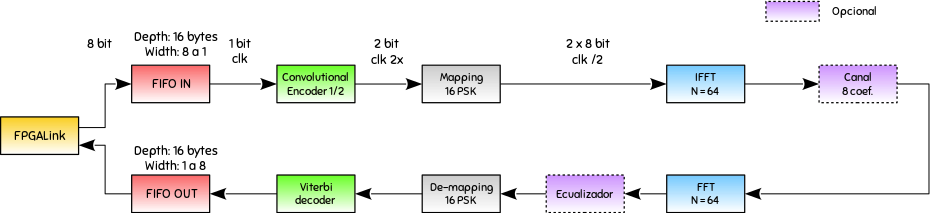

# MSE_21DSC

> Canal de comunicaciones para sistema digital para las comunicaciones


<a href="https://github.com/pslavkin/mse_21sdc"></a>
---
## Progreso

- :heavy_check_mark: genero script tcl para recrear todo con lo minimo para 7010 y 7020
- :construction:     agregar
- :red_circle:       agregar

---
## Tabla de contenidos

- [tcl](#tcl)
- [Hierarchy](#hierarchy)
- [Team](#team)
- [FAQ](#faq)
- [Support](#support)
- [License](#license)
<!--
asi puedo linkear a otra seccion de otro ducumento.. por ahor dejo todo plano y vemos..
-- [linky](nuevo.md#nuevo)
-- [linkx](nuevo.md#viejo)
/!-->
---

## tcl
   explicar aca como generar y usar el tcl con rutas relativas


## Hierarchy

```ruby
.
├── bd
│   └── design_1
│       ├── design_1.bd
│       └── hdl
│           └── design_1_wrapper.vhd
├── board_store
│   ├── arty-z7-10
│   │   └── A.0
│   │       ├── board.xml
│   │       ├── part0_pins.xml
│   │       └── preset.xml
│   └── arty-z7-20
│       └── A.0
│           ├── board.xml
│           ├── part0_pins.xml
│           └── preset.xml
├── doc
│   └── pics
│       └── ofdm.png
├── FPGA_interface.sdk
│   ├── design_1_wrapper.hdf
│   └── FPGA_interface
│       └── src
│           ├── dma.c
│           ├── dma.h
│           ├── echo.c
│           ├── iic_phyreset.c
│           ├── lscript.ld
│           ├── main.c
│           ├── platform_config.c
│           ├── platform_config.h
│           ├── README.txt
│           └── Xilinx.spec
├── hdl
│   ├── Cordic_tb.vhd
│   ├── IPs
│   │   ├── rtl_system_m_axis_block_fifo
│   │   │   ├── rtl_system_m_axis_block_fifo_clocks.xdc
│   │   │   ├── rtl_system_m_axis_block_fifo.veo
│   │   │   ├── rtl_system_m_axis_block_fifo.vho
│   │   │   ├── rtl_system_m_axis_block_fifo.xci
│   │   │   ├── rtl_system_m_axis_block_fifo.xdc
│   │   │   ├── rtl_system_m_axis_block_fifo.xml
│   │   │   └── synth
│   │   │       └── rtl_system_m_axis_block_fifo.vhd
│   │   └── rtl_system_s_axis_block_fifo
│   │       ├── rtl_system_s_axis_block_fifo_clocks.xdc
│   │       ├── rtl_system_s_axis_block_fifo.veo
│   │       ├── rtl_system_s_axis_block_fifo.vho
│   │       ├── rtl_system_s_axis_block_fifo.xci
│   │       ├── rtl_system_s_axis_block_fifo.xdc
│   │       ├── rtl_system_s_axis_block_fifo.xml
│   │       └── synth
│   │           └── rtl_system_s_axis_block_fifo.vhd
│   ├── rtl_system_M_AXIS.vhd
│   ├── rtl_system_S_AXIS.vhd
│   ├── rtl_system_S_AXI.vhd
│   └── rtl_system.vhd
├── README.md
└── script.tcl

19 directories, 41 files
```

<!--

## Example (Optional)

```c
// code test

void main (void) {
   return 0;
}

```
-->

---
<!--

## Installation

- All the `code` required to get started
- Images of what it should look like

### Clone

- Clone this repo to your local machine using `https://github.com/fvcproductions/SOMEREPO`

### Setup

- If you want more syntax highlighting, format your code like this:

> update and install this package first

```shell
$ brew update
$ brew install fvcproductions
```

> now install npm and bower packages

```shell
$ npm install
$ bower install
```

- For all the possible languages that support syntax highlithing on GitHub (which is basically all of them), refer <a href="https://github.com/github/linguist/blob/master/lib/linguist/languages.yml" target="_blank">here</a>.


## Features
## Usage (Optional)
## Documentation (Optional)
## Tests (Optional)

- Going into more detail on code and technologies used
- I utilized this nifty <a href="https://github.com/adam-p/markdown-here/wiki/Markdown-Cheatsheet" target="_blank">Markdown Cheatsheet</a> for this sample `README`.


## Contributing

> To get started...

### Step 1

- **Option 1**
    - 🍴 Fork this repo!

- **Option 2**
    - 👯 Clone this repo to your local machine using `https://github.com/joanaz/HireDot2.git`

### Step 2

- **HACK AWAY!** 🔨🔨🔨

### Step 3

- 🔃 Create a new pull request using <a href="https://github.com/joanaz/HireDot2/compare/" target="_blank">`https://github.com/joanaz/HireDot2/compare/`</a>.

-->


<!--

## FAQ

- **How do I do *specifically* so and so?**
    - No problem! Just do this.


-->

## Support

Me puedes encontrar en:

   <a href="https://www.linkedin.com/in/pablo-slavkin/" target="_blank"></a>


## License

[](http://badges.mit-license.org)

- **[MIT license](http://opensource.org/licenses/mit-license.php)**
<!-- 
- Dopyright 2019 © <a href="http://fvcproductions.com" target="_blank">FVCproductions</a>.
-->


## Team

| <a href="https://github.com/pslavkin" target="_blank">**pablo**</a>                             | <a href="https://github.com/pslavkin" target="_blank">**gonzalo**</a>                  |
| :---:                                                                                              | :---:                                                                              |
| [](https://github.com/pslavkin) | [](https://github.com/gonzalolavigna)  |
| <a href="https://github.com/pslavkin" target="_blank">`github.com/pslavkin`</a>                    | <a href="https://github.com/gonzalolavigna" target="_blank">`github.com/gonzalolavigna`</a>    |

<!--

## FAQ

- **How do I do *specifically* so and so?**
    - No problem! Just do this.


-->

## Support

Nos puedes encontrar en:


## License

[](http://badges.mit-license.org)

- **[MIT license](http://opensource.org/licenses/mit-license.php)**
<!--
- Dopyright 2019 © <a href="http://fvcproductions.com" target="_blank">FVCproductions</a>.
-->
